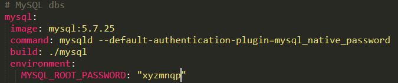
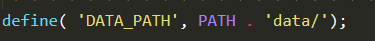
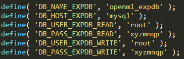
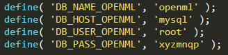

# OpenML Docker compose images/scripts for local development setup (Linux/Windows)

## **For local dev environment setup only, Insecure & Not for Production Setup**


# Issues/limitations
- current only works on port 80
- wiki powered by gollum is not working (in the new OpenML frontend this will no longer be used).
- **Only the local admin account works for now.** There is an issue with login and it will not be possible to create and login with other accounts (Work in progress)


# Requirements

- Git (https://git-scm.com/)
- Docker (https://www.docker.com/get-docker)

For Linux: docker commands assume you can use docker without sudo (your user is in docker group, ex: sudo usermod -aG docker $USER). Otherwise prefix docker commands with sudo. 


# Instructions


### Step 1: Clone the repos

Note that we clone docker_changes branch of OpenML repo. 

```
git clone https://github.com/openml/openml-docker-dev.git

cd openml-docker-dev

git clone -b docker_changes https://github.com/openml/OpenML.git

```

####  New website configuration (Optional)
Skip this step unless you want to use the new website.

- Clone the new website from here (also inside openml-docker-dev), as it has some code changes
```
git clone -b docker https://github.com/PortML/openml.org.git
cd openml.org

```
- Edit DATABASE_URI field in *.flaskenv* to add in the mysql password in place of PASSWORD-
  (use the same password as the mysql password in docker-compose.yml)
- Continue with remaining steps and view Step 7 for testing
new website changes


### Step 2: Configure docker and OpenML

Edit *docker-compose.yml* mainly define a secure **mysql password**:

**(leaving the default will make docker-compose fail)**




Copy *OpenML\openml_OS\config\BASE_CONFIG-BLANK.php* to *OpenML\openml_OS\config\BASE_CONFIG.php*

Check & change *BASE_CONFIG.php* as appropriate:

Define BASE_URL as localhost:


Define path and data path. In the docker compose, note that /var/www/html is mapped to ./OpenML.




Configure details for the experiment database.



Configure details for the OpenML database.



Configure elastic search.


Disable email activation in *OpenML\openml_OS\ion_auth.php*


### Step 3: Starting docker-compose

On the openml-docker-dev root folder, where *docker-compose.yml* is located run:

```
docker pull docker.elastic.co/elasticsearch/elasticsearch:6.8.2

docker-compose up
```
The elasticsearch pull is needed only for the very first time. Images can take few minutes to build for the first time, 
after start wait a few seconds for services to be ready, ex: MySQL ready for connections)


### Step 4 Check phpmyadmin at http://localhost:8080/


### Step 5: Init dbs, admin user & elastic search indexes

Execute in a new window/shell: 

```
docker exec -it openmldockerdev_website_1 php index.php cron init_local_env
```

(take note the printed admin username and password, and wait to finish, can take 1-2mins)


Change data folder owner to www-data apache user in container, allow for logs/uploads in data folder, resets log file permissions created in previous init step

Execute in a new window/shell:
```
docker exec -it openmldockerdev_website_1 chown -R www-data:www-data /var/www/html/data
```


###  Step 6: Final tests

Login on http://localhost with admin and saved password


### Check dataset 
We have 1 sample dataset


### Test upload dataset & wait for feature calculation. The status will change to active in a few minutes.


### Note: Files in OpenML cloned repo are mounted inside the website container, any change will reflect immediately on the site

### Step 7 New website checks (Optional)
- Check the new website running at 127.0.0.1/5000. It should look similar to new.openml.org
- Sign up as a new user in the new website. (Note that you cannot use the admin account from the old website to login here)
- Sign in with your email and password
- You should be able to see your profile
- Dataset upload is not working yet (some connection issue in docker compose - in progress)
