# OpenML Docker compose images/scripts for local development setup (Linux/Windows)

# **For local dev environment setup only, Insecure & Not for Production Setup**


# Issues/limitations
- current only works on port 80
- wiki powered by gollum is not working yet

# Requirements

- Git
- Docker

For Linux: docker commands assume you can use docker without sudo (your user is in docker group, ex: sudo usermod -aG docker $USER). Otherwise prefix docker commands with sudo. 


# Instructions


## Clone this repository & clone OpenML repo/branch inside 
### (temporary: using *enable-docker-changes* branch)

```
git clone https://github.com/openml/openml-docker-dev.git

cd openml-docker-dev

git clone -b enable-docker-changes https://github.com/openml/OpenML.git
```

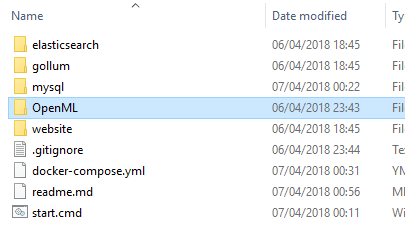

## Fill in Docker-compose Configuration

edit *docker-compose.yml* mainly define a secure mysql password:

**(leaving the default will make docker-compose fail)**

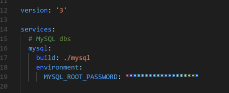

## Fill in OpenML Configuration file

copy *OpenML\openml_OS\config\BASE_CONFIG-BLANK.php* to *OpenML\openml_OS\config\BASE_CONFIG.php*

Check & change *BASE_CONFIG.php* as appropriate, ex: (mysql password)

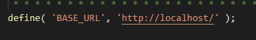

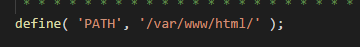


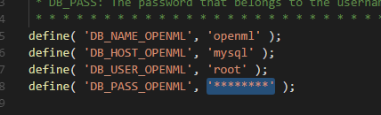

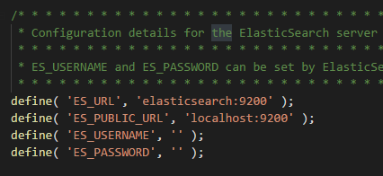

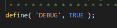

Disable email activation in *OpenML\openml_OS\ion_auth.php*

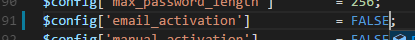

## Build images & start service containers using docker-compose

on the openml-docker-dev root folder, where *docker-compose.yml* is located run:

```
docker-compose up
```

(images can take few minutes to build for the first time, after start wait a few seconds for services to be ready, ex: MySQL ready for connections)

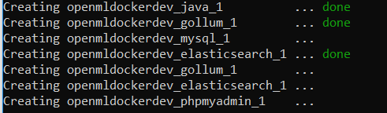

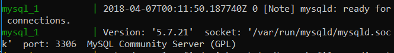

## Check phpmyadmin at http://localhost:8080/

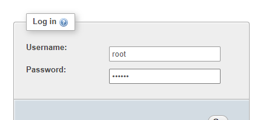

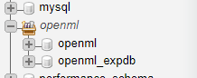

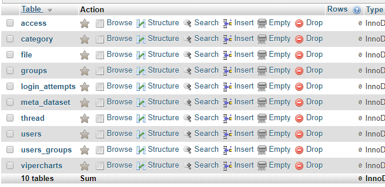


## Init dbs, admin user & elastic search indexes

Execute in a new window/shell: 

```
docker exec -it openmldockerdev_website_1 php index.php cron init_local_env
```

(take note the generated admin password, and wait to finish, can take 1-2mins)

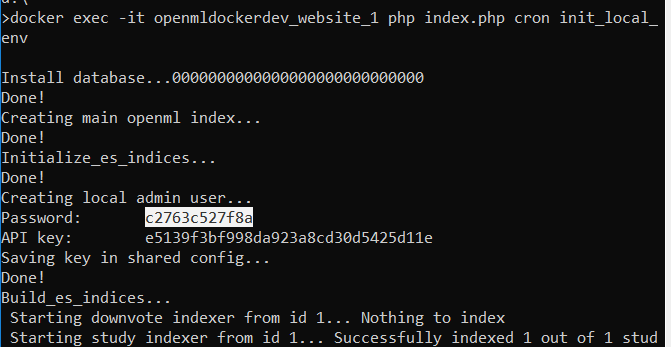

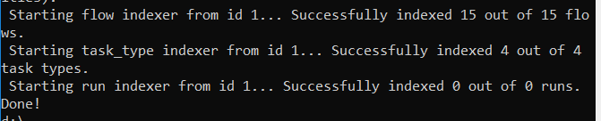 

## Change data folder owner to www-data apache user in container, allow for logs/uploads in data folder, resets log file permissions created in previous init step

Execute in a new window/shell:
```
docker exec -it openmldockerdev_website_1 chown -R www-data:www-data /var/www/html/data
```

## Should be running now! Final tests:

### Login on http://localhost with admin and saved password

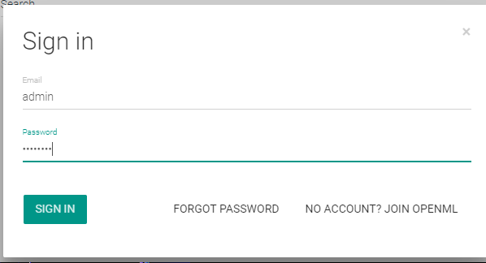

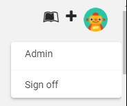

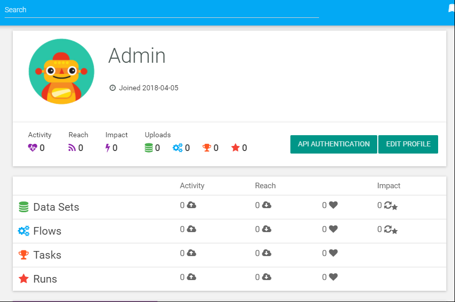

### Check elastic search
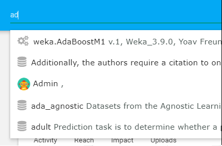

### Test upload dataset & wait for feature calculation
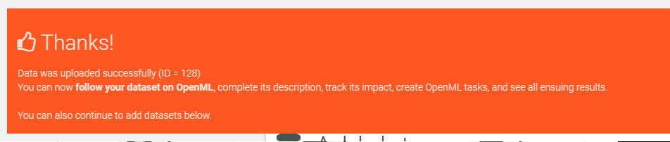

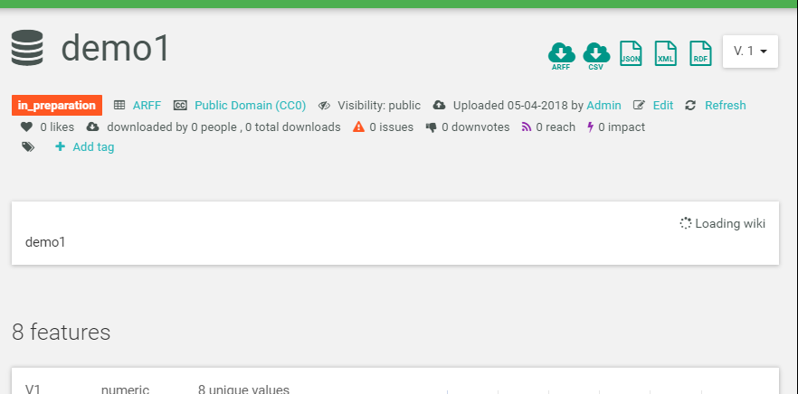

### Note: Files in OpenML cloned repo are mounted inside the website container, any change will reflect immediately on the site


